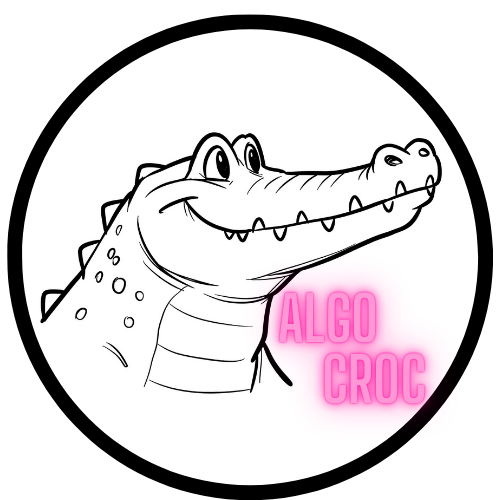

# AlgoCroc AI



Welcome to **AlgoCroc AI** — a web application that enables you to chat with AI models for free. Designed for seamless access to free AI functionalities, this project brings together interactive chat capabilities and image generation inside a single interface, without the need for API keys for basic models.

## Demo

[Live Demo](https://github.com/RAHUL04012006/AI)


## Features

- **Chat with AI:** Send messages and interact with various available models.
- **Model Selection:** Choose from multiple models (like GPT-4o-mini, DeepSeek, Claudde Sonnet, and more) via a dropdown.
- **Image Generation:** Type image prompts to create AI-generated art with integrated image generation models.
- **File Upload:** Upload files (text, images, docs) for processing and analysis.
- **Session Stats:** Track stats (messages, files uploaded, images generated) within your session.
- **Smart Touch & Layout:** Responsive design optimized for mobile and desktop with accessibility fixes.

## File Structure

```
/AI
│
├── index.html           # Main web app interface
├── AlgoCroc.png         # Project logo
├── css/
│   ├── mobile-fixes.css # CSS fixes for mobile devices
│   └── styles.css       # Core styles
└── js/
    ├── chat-app.js             # Main chat application logic
    ├── pollinations-integration.js # AI image generation & integration
    └── puter-integration.js    # File upload & processing
```

## Usage

1. **Clone the repository:**
   ```sh
   git clone https://github.com/RAHUL04012006/AI.git
   ```
2. **Open `index.html`** in your browser.

No installation is needed, and basic models work without requiring login or API keys. Premium models may prompt for authentication.

## Technologies Used

- **HTML/CSS/JavaScript:** Core UI and logic.
- **Third-party AI APIs:** For chat and image generation.
- **Responsive Design:** Optimized with mobile fixes.
- **Integration Scripts:** External libraries for AI and file operations.

## Contributing

Contributions are welcome! Feel free to submit issues or pull requests.

## License

This project is open-source and available under the MIT License.

---

Created by [Rahul-Algocroc](https://rahul04012006.pythonanywhere.com/) | Powered by [Puter.js](https://puter.com)
